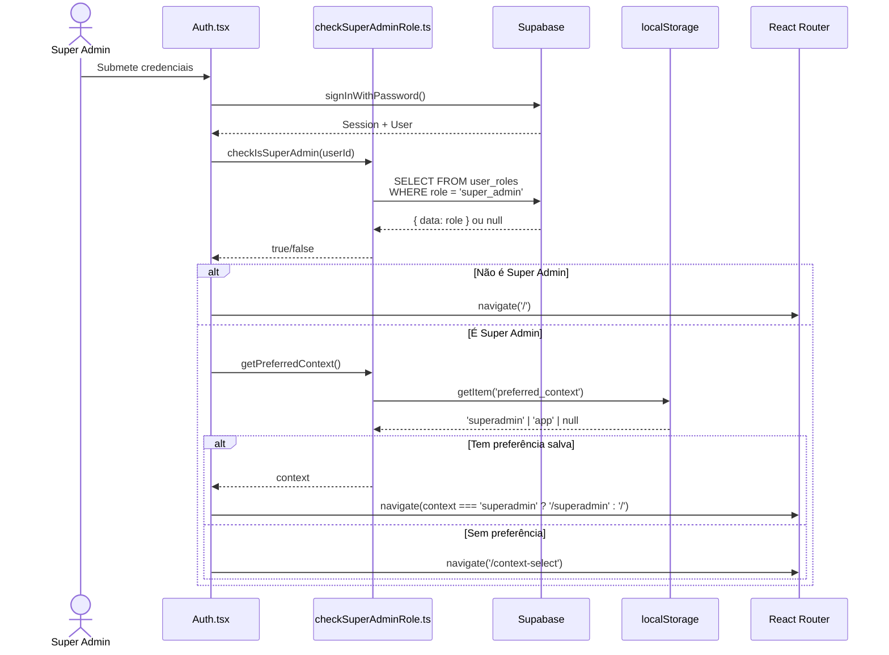
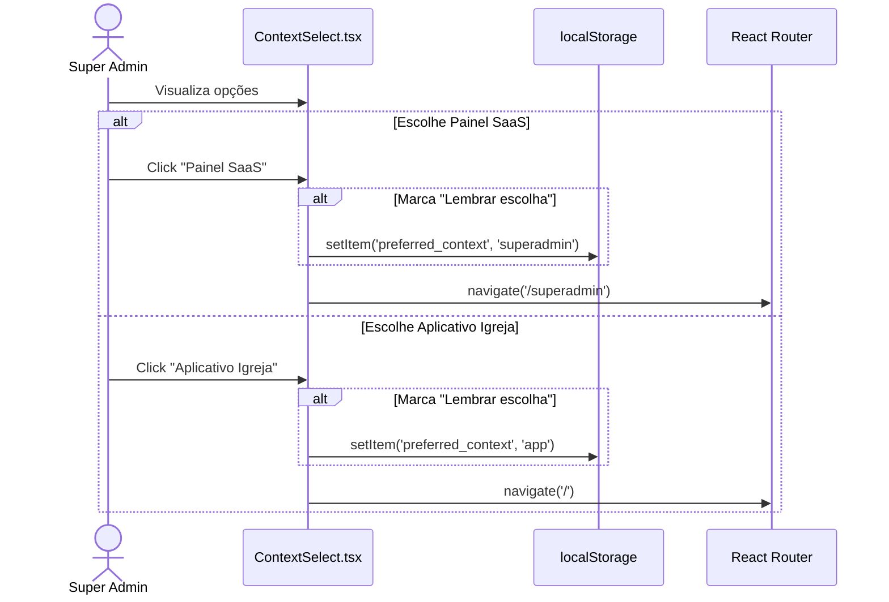
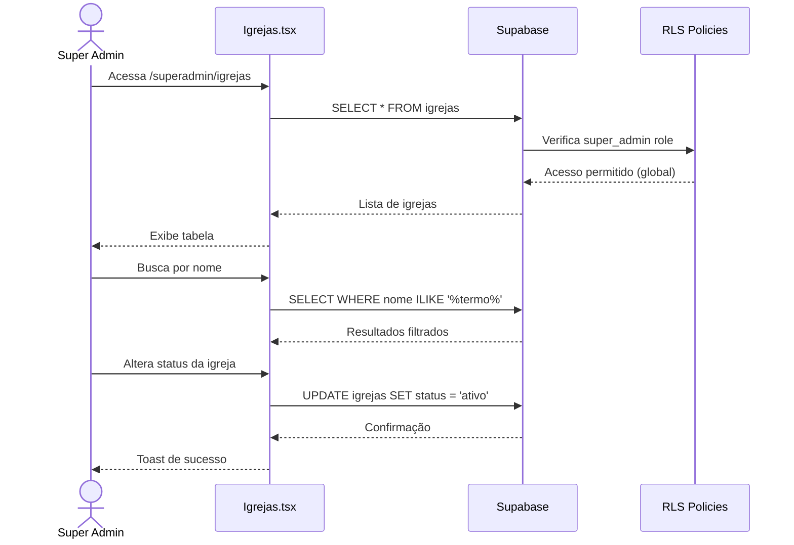
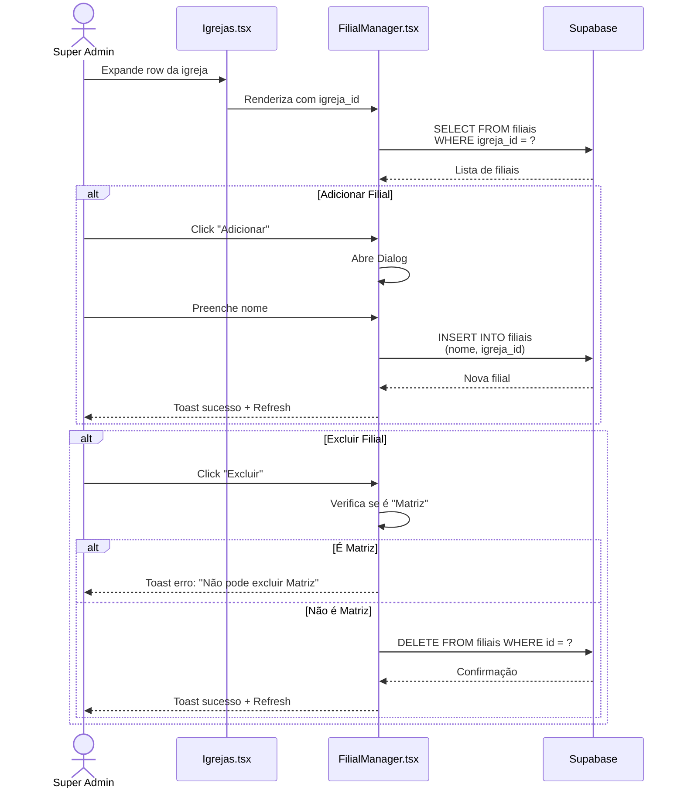
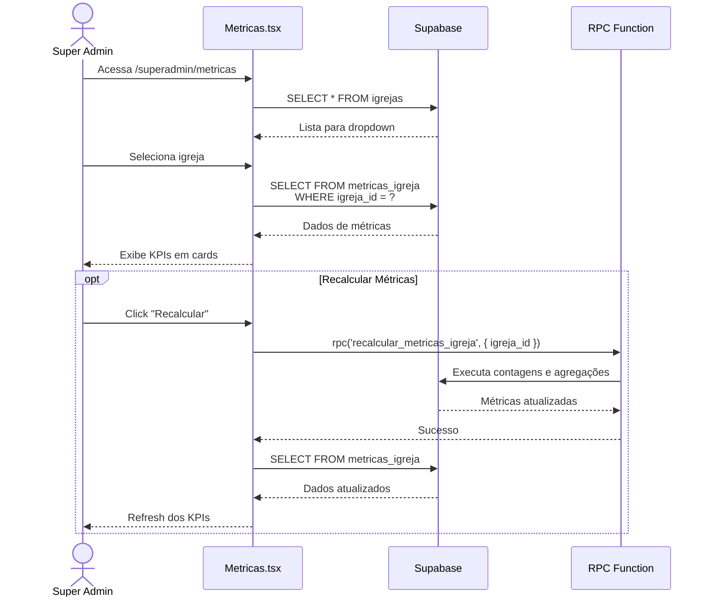
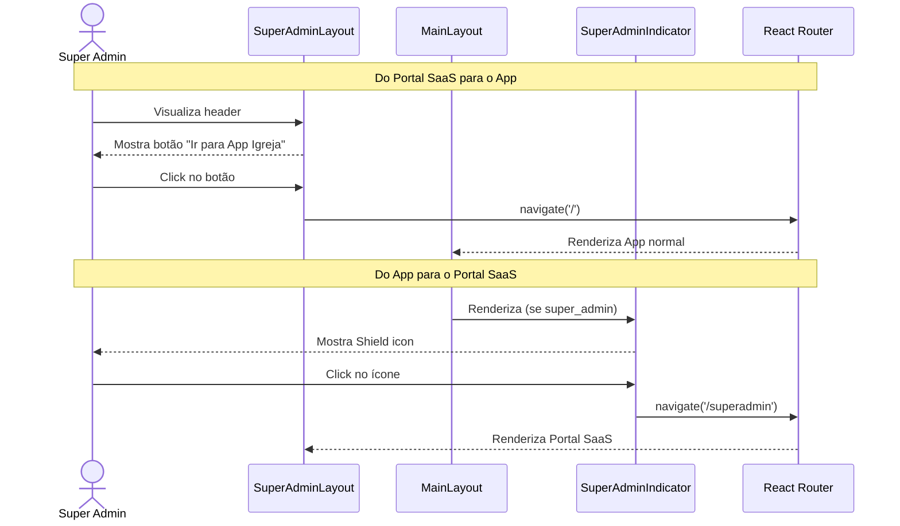

# Sequência — Super Admin

Diagramas de sequência para as principais interações do portal Super Admin.

## Login e Seleção de Contexto

## Seleção de Contexto

## Gerenciamento de Igrejas

## Gerenciamento de Filiais

## Consulta de Métricas

## Troca de Contexto

---

**Última atualização:** 2026-01-04
