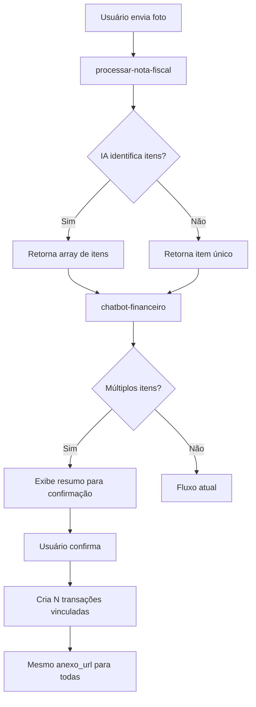

# Proposta: Extração Multi-Item de Boletos e Notas Fiscais

> **Status:** Proposta  
> **Data:** 29/01/2026  
> **Autor:** Lovable AI  
> **Prioridade:** Média

---

## 📌 Contexto

Atualmente, quando um usuário envia uma foto de boleto ou nota fiscal pelo sistema (chatbot financeiro ou dialog de processamento), a IA extrai **um único registro** contendo:
- `valor_total`: Soma de todos os itens
- `descricao`: Texto único descrevendo o documento
- `fornecedor_nome`: Nome do emissor

### Problema Real
Um boleto de imobiliária típico contém:
| Item | Valor |
|------|-------|
| Aluguel | R$ 2.500,00 |
| Taxa de Boleto | R$ 3,50 |
| IPTU | R$ 150,00 |
| **Total** | **R$ 2.653,50** |

**Hoje:** Sistema cria 1 transação de R$ 2.653,50 na categoria "Aluguel" ou "Despesas Gerais"

**Desejado:** Sistema cria 3 transações separadas:
- R$ 2.500,00 → Categoria: Aluguel
- R$ 3,50 → Categoria: Taxas Bancárias
- R$ 150,00 → Categoria: IPTU/Impostos

---

## 🎯 Objetivo

Permitir que a IA identifique e separe automaticamente os componentes de um boleto/nota fiscal em múltiplas transações, cada uma com sua categoria apropriada.

---

## 📐 Arquitetura Proposta

### 1. Alteração no Prompt da IA (processar-nota-fiscal)

**Antes:**
```typescript
interface NotaFiscalExtraida {
  fornecedor_nome: string;
  valor_total: number;
  descricao: string;
  // ...
}
```

**Depois:**
```typescript
interface ItemExtraido {
  descricao: string;
  valor: number;
  categoria_sugerida?: string;  // Ex: "Aluguel", "IPTU", "Taxa Bancária"
}

interface NotaFiscalExtraida {
  fornecedor_nome: string;
  valor_total: number;
  descricao_geral: string;
  itens: ItemExtraido[];  // Array de itens identificados
  // ...
}
```

### 2. Novo Prompt para GPT-4o Vision

```text
Analise este documento fiscal e extraia TODOS os itens de cobrança separadamente.

Para cada item identificado, retorne:
- descricao: Nome do item (ex: "Aluguel", "IPTU", "Taxa de Boleto")
- valor: Valor numérico do item
- categoria_sugerida: Categoria contábil sugerida

Regras de categorização:
- Aluguel, Locação → "Aluguel"
- IPTU, Imposto Predial → "Impostos e Taxas"
- Taxa de Boleto, Tarifa Bancária → "Taxas Bancárias"
- Condomínio → "Condomínio"
- Água, Saneamento → "Água"
- Luz, Energia → "Energia Elétrica"
- Seguro → "Seguros"

Se não conseguir separar os itens, retorne um único item com o valor total.
```

### 3. Fluxo de Dados



### 4. Modelo de Dados

#### Opção A: Transações Independentes com Vínculo
```sql
-- Cada item vira uma transação separada
-- Todas compartilham o mesmo anexo_url
-- Campo opcional para agrupar:
ALTER TABLE transacoes_financeiras 
ADD COLUMN grupo_documento_id UUID;

-- Índice para buscar itens do mesmo documento
CREATE INDEX idx_transacoes_grupo_documento 
ON transacoes_financeiras(grupo_documento_id) 
WHERE grupo_documento_id IS NOT NULL;
```

#### Opção B: Transação Pai + Itens (mais complexo)
```sql
-- Tabela de itens detalhados
CREATE TABLE itens_transacao (
  id UUID PRIMARY KEY DEFAULT gen_random_uuid(),
  transacao_id UUID REFERENCES transacoes_financeiras(id),
  descricao TEXT NOT NULL,
  valor NUMERIC(15,2) NOT NULL,
  categoria_id UUID REFERENCES categorias_financeiras(id),
  created_at TIMESTAMPTZ DEFAULT now()
);
```

**Recomendação:** Opção A é mais simples e compatível com o modelo atual.

---

## 🖥️ Alterações de Interface

### 1. ProcessarNotaFiscalDialog
- Exibir lista de itens identificados após processamento
- Permitir edição/remoção de itens antes de confirmar
- Permitir adicionar item manualmente

```tsx
// Novo componente de revisão
<ItensExtraidosReview
  itens={itensExtraidos}
  onItemChange={(index, item) => handleItemChange(index, item)}
  onItemRemove={(index) => handleItemRemove(index)}
  onItemAdd={() => handleItemAdd()}
  onConfirm={() => criarTransacoes(itensExtraidos)}
/>
```

### 2. Chatbot Financeiro
- Novo estado: `AGUARDANDO_CONFIRMACAO_ITENS`
- Mensagem resumo: "Identifiquei 3 itens neste boleto: ..."
- Botões: "✅ Confirmar" | "✏️ Editar" | "❌ Cancelar"

### 3. Lista de Transações
- Ícone indicando que transação faz parte de grupo
- Ao clicar, mostrar outras transações do mesmo documento
- Anexo compartilhado visível em todas

---

## 📊 Impacto

### DRE
✅ **Melhoria significativa**: Cada despesa é contabilizada na categoria correta
- IPTU vai para "Impostos e Taxas"
- Aluguel vai para "Ocupação"
- Taxas vão para "Despesas Bancárias"

### Fluxo de Caixa
✅ **Sem alteração**: Todas as transações do grupo têm mesma data de pagamento

### Conciliação Bancária
⚠️ **Atenção**: O extrato bancário mostrará 1 débito de R$ 2.653,50. Sistema precisará:
- Permitir vincular 1 extrato a N transações (já suportado via `conciliacoes_lote`)
- Ou mostrar aviso de "transação agrupada"

---

## 🔧 Arquivos a Modificar

| Arquivo | Alteração |
|---------|-----------|
| `supabase/functions/processar-nota-fiscal/index.ts` | Novo prompt e interface de retorno |
| `supabase/functions/chatbot-financeiro/index.ts` | Handler para múltiplos itens |
| `src/components/financas/ProcessarNotaFiscalDialog.tsx` | UI de revisão de itens |
| `src/components/financas/TransacaoDialog.tsx` | Suporte a criar múltiplas transações |

---

## 📋 Critérios de Aceite

1. [ ] IA identifica e separa itens de boleto com pelo menos 80% de acurácia
2. [ ] Usuário pode revisar e editar itens antes de confirmar
3. [ ] Todas as transações do grupo compartilham o mesmo anexo
4. [ ] DRE reflete corretamente cada categoria de despesa
5. [ ] Conciliação permite vincular extrato único a múltiplas transações

---

## ⏱️ Estimativa de Esforço

| Etapa | Complexidade | Estimativa |
|-------|-------------|------------|
| Alteração do prompt IA | Baixa | 2h |
| Backend chatbot-financeiro | Média | 4h |
| UI ProcessarNotaFiscalDialog | Média | 4h |
| Testes e ajustes | Média | 4h |
| **Total** | | **~14h** |

---

## 🚀 Próximos Passos

1. Validar proposta com stakeholders
2. Definir categorias padrão para mapeamento automático
3. Coletar exemplos de boletos para treinar/testar prompt
4. Implementar em fases:
   - Fase 1: Extração multi-item (IA)
   - Fase 2: UI de revisão
   - Fase 3: Integração com conciliação

---

## 📚 Referências

- [ADR-001: Separação Fato Gerador vs Caixa vs DRE](../adr/ADR-001-separacao-fato-gerador-caixa-dre.md)
- [ADR-025: Fluxo Despesas com Baixa Automática](../adr/ADR-025-fluxo-despesas-baixa-automatica.md)
- [Memory: financial-chatbot-ocr-data-flow](útil para implementação)
